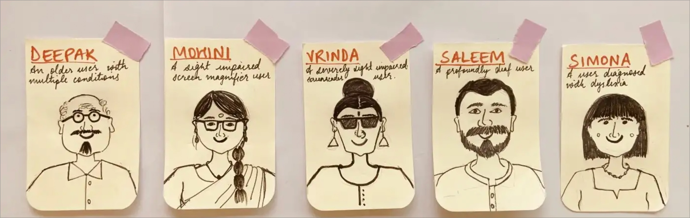
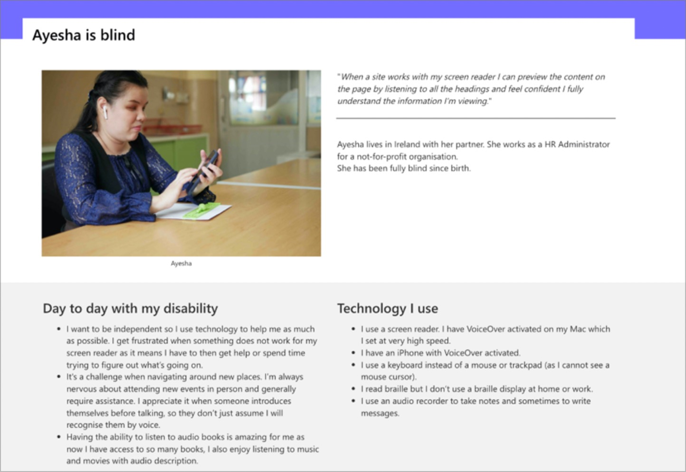
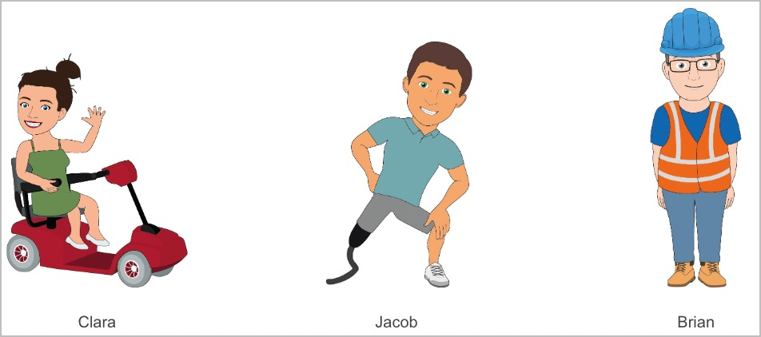
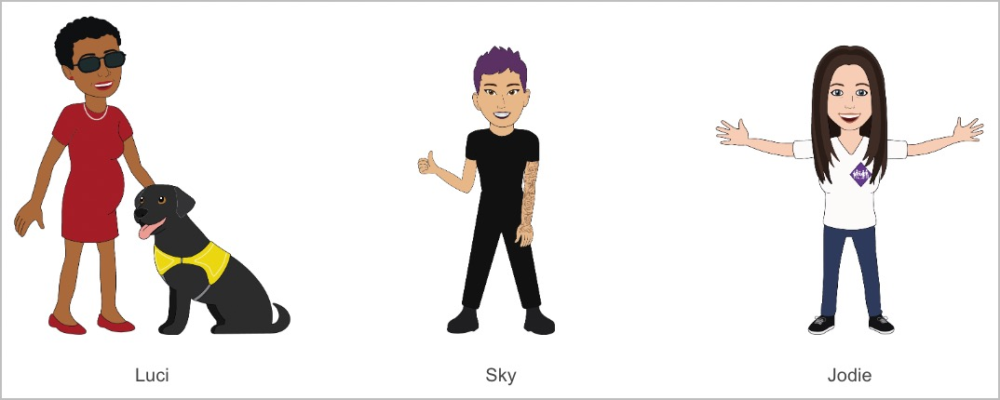
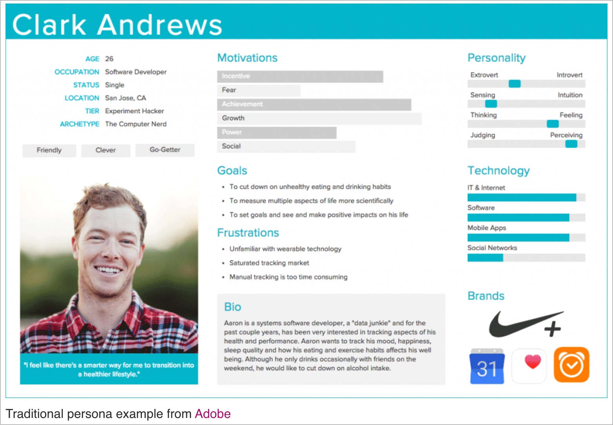
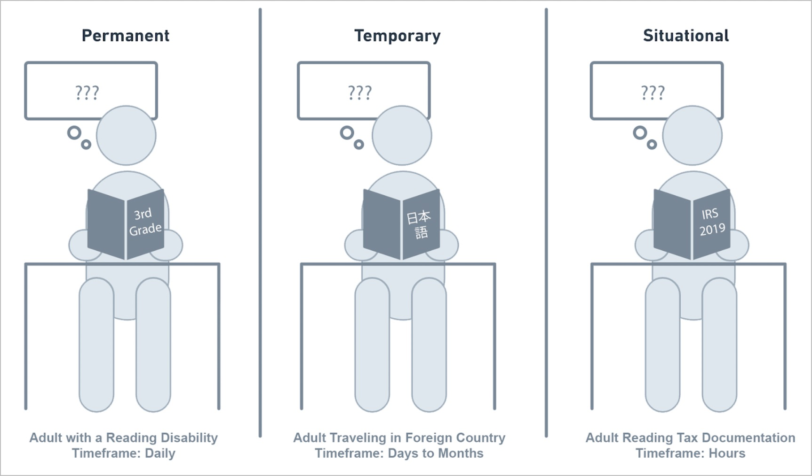
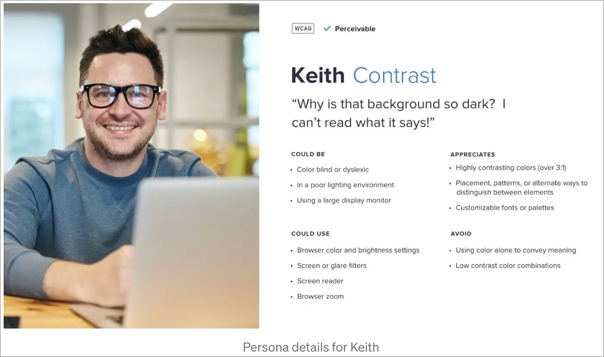

# Personas → build empathy!

Concept from book **Inmates are Running the Asylum** *by Alan Cooper*, first published in 1999. He coined the term ‘elastic user’ to demonstrate the idea of a user ‘who must bend and stretch’ to adapt to the needs of the moment, rather than what they themselves, require. → instead, bend and stretch and adapt to the needs of the user! (https://www.sage.com/en-gb/blog/creating-user-personas-to-improve-accessibility/)

*Accessibility Personas represent the segment of differently abled users that will be using our product/service and are created keeping their accessibility needs in mind.* (https://medium.com/@sanchita.sri/accessibility-personas-51433d886841)

Kann man wirklich behaupten, dass 1 von 5 (oder 4) Personen eine **für digitale Barrierefreiheit relevante** Behinderung hat? Jemand ohne Beine ist ja schliesslich nicht betroffen...

🤔 Soll ich generell "they" schreiben?!

Warum nicht einfach neuer Terminus "diffabled" einführen für "differently abled"? 😅 statt disabled, handicapped, person of disability, special needs...

Pro Persona ein 1-seitiger "Comic" mit alltäglichen Situationen! Z.B. Vreni als Grandma Veronica, mit Enkelkindern zusammen, dann mit dem Handy und einem typischen Problem (z.B. Farbkontraste) → auch von einer realen Person einsprechen lassen?!

Generell: Berichte beginnen mit etwas Geschichte, um Emotionen und Verbindung zu wecken:

- First typewriter → Something was created for a disabled person, and the whole world benefits from it now
- Stephen Hawkins → Thanks to the fact that we could include him and enable him, the whole world benefits from his wisdom

Bei Accessibility geht es um Menschen, die du kennst und liebst: deine Mutter (sieht nicht mehr so gut), dein Grossvater (Parkinson), deine Cousine (frisch gebackene Mutter), deinen Nachbarn (Autist mit Social Anxiety), den Verlobten der netten afrikanischen Kellnerin im Bistro gegenüber (hat in Tansania ein kleines online Business, aber oft sehr langsames Internet).

Es geht aber auch um DICH als Web-Professional:

- Als Designer:in/UX bewegst du dich von persönlichen Vorlieben bez. Ästhetik und Nutzer-Interaktion, hin zu klaren, wissenschaftlich fundierten Design-Prinzipien. Diese garantieren eine möglichst universelle Nutzung deiner Angebote.
  - Ggf. Folie von AdNovum UX-Typ einblenden, dass nur einige wenige Kriterien der WCAG das visuelle Design betreffen?
  - Accessibility is part of UX! In fact, it is just great UX!
- Als Barrierefreiheits-bewusster Developer orientierst du dich an den universellen, seit Jahrzehnten gültigen HTML-Standards und Konventionen. Dein Code wird dadurch von Mensch und Maschine (SEO) besser verstanden; er wird schlanker, besser lesbar und einfacher wartbar (1x schreiben, 10x überarbeiten).
  - Barrierefreiheit kann mit BEM verglichen werden: wenn man es konsequent einsetzt, treten viele potenzielle Probleme komplexer Projekte (bzw. generell in der Zusammenarbeit) deutlich vermindert auf.

Es geht **nicht** darum, Kreativität zu beschneiden, sondern darum, Chaos zu vermeiden und Energien zu bündeln.

**Es geht darum:**

- Ausgrenzung zu verhindern (vgl. mit Diskriminierung, Rassismus)
- Menschliches Potenzial zu ergründen (über den Tellerrand hinaus schauen) → First Typewriter, Stephen Hawkins
- Demokratie, um die Ermächtigung aller Erdenbürger:innen

Carly Fiorina: "Human potential is the only limitless resource we have on this earth."

- "Accessibility is about people, not about standards!" (https://www.stevekurzman.com/accessibility-personas.html)

## Resources

- https://webaim.org/articles/userperspective/
- https://the-pastry-box-project.net/anne-gibson/2014-july-31
- https://alphagov.github.io/accessibility-personas/
  - https://www.gov.uk/government/publications/understanding-disabilities-and-impairments-user-profiles

- https://www.microsoft.com/design/inclusive/
  - https://www.microsoft.com/design/assets/inclusive/InclusiveDesign_RespectingFocus.pdf
  - https://www.microsoft.com/design/assets/inclusive/InclusiveDesign_DesigningForGuidance.pdf
  - https://www.microsoft.com/design/assets/inclusive/InclusiveDesign_DesigningForGuidance.pdf
  - file:///Users/josua/Downloads/inclusive_toolkit_manual_final.pdf
  - file:///Users/josua/Downloads/inclusive_toolkit_activities.pdf
- https://www.w3.org/TR/coga-usable/#persona
- https://www.w3.org/WAI/people-use-web/user-stories/
  - https://www.w3.org/WAI/people-use-web/abilities-barriers/
  - https://www.w3.org/WAI/people-use-web/tools-techniques/
- https://www.abilitynet.org.uk/sites/abilitynet.org.uk/files/Barclays-Diverse-Personas-Issue-1.pdf

## Microsoft Inclusive Design

- "Inclusive design is for those who want to make great products for the greatest number of people."
- "But here’s the problem: If we use our own abilities as a baseline, we make things that are easy for some people to use, but difficult for everyone else."
- "It starts with seeing human diversity as a resource for better designs."
- "If we use our own abilities and biases as a starting point, we end up with products designed for people of a specific gender, age, language ability, tech literacy, and physical ability. Those with specific access to money, time, and a social network."
  - "...this creates the potential to ignore much of the range of humanity."
- "Accessibility defined: 1. The qualities that make an experience open to all. 2. A professional discipline aimed at achieving No. 1."
- "Human beings have amazing capabilities to adapt to different situations, and understanding those adaptations is the key to real **insight**."
- "Are we forced to adapt to technology, or is technology adapting to us?"
- "Empathy is an important part of many different forms of design."

Solve for one, extend to many:

## Statistics

- https://wearepurple.org.uk/the-purple-pound-infographic/
- https://www.cdc.gov/visionhealth/basics/ced/fastfacts.htm
- https://www.nhs.uk/conditions/colour-vision-deficiency/

2.2 billion people have vision impairment: https://www.who.int/en/news-room/fact-sheets/detail/blindness-and-visual-impairment

From https://www.gov.uk/government/publications/understanding-disabilities-and-impairments-user-profiles:

- Statistics about sight loss (https://www.gov.uk/government/publications/understanding-disabilities-and-impairments-user-profiles/ashleigh-partially-sighted-screenreader-user)
  - Nearly 2 million people in the UK are blind or partially sighted.
  - Only one-third of people registered blind or partially sighted are in paid work.
  - Over one-third of blind or partially sighted people also have depression, making it the most common secondary condition for those with sight loss.
- Statistics about sight loss (https://www.gov.uk/government/publications/understanding-disabilities-and-impairments-user-profiles/claudia-partially-sighted-screen-magnifier-user)
  - About 2 million people in the UK have sight loss, and this figure is expected to double by 2050.
  - Individuals from black and Asian populations have a higher risk of diabetic eye disease and sight loss than white populations.
  - Less than one-third of people who were registered blind or partially sighted were offered training to help them get around in the year after they were registered.
- Statistics about disability (https://www.gov.uk/government/publications/understanding-disabilities-and-impairments-user-profiles/christopher-user-with-rheumatoid-arthritis)
  - Almost 1 in 5 people (around 19% of the population) in the UK have a disability. The likelihood of having a disability increases the older you get.
  - Nearly 700,000 people in the UK have rheumatoid arthritis.
  - There are nearly 7 million people with disabilities who are of working age - nearly 19% of the working population.
- Statistics about autism (https://www.gov.uk/government/publications/understanding-disabilities-and-impairments-user-profiles/pawel-user-with-aspergers)
  - About 700,000 people in the UK are on the autistic spectrum.
  - Only 16% of people with autism in the UK are in full time paid employment.
  - 40% of people with autism have an anxiety disorder - it’s 15% in the general population.
- Statistics on hearing loss (https://www.gov.uk/government/publications/understanding-disabilities-and-impairments-user-profiles/ron-older-user-with-multiple-conditions)
  - 11 million people in the UK are deaf or hard of hearing.
  - People wait 10 years on average before addressing their hearing loss.
  - Hearing loss affects:
    - over 70% of people aged 70 and older
    - over 40% of people aged 50 and over
- Statistics about dyslexia
  - 6.3 million people (around 10% of the UK population) have dyslexia.
  - 1 in 6 adults has the reading level of an 11-year-old.
  - People with dyslexia often have other conditions, including dyscalculia (difficulties with numbers), ADD (attention deficit disorder) and ADHD (attention deficit hyperactivity disorder).

---

From https://learningsolutionsmag.com/articles/planning-for-accessibility-empathy-and-personas:

## Modalities

- Vision impaired
  - Blind, colour blind, achromatic, low vision, tunnel vision, cataract, floaters, sight deterioration, glaucoma (partially sighted due to glaucoma and diabetes, https://www.gov.uk/government/publications/understanding-disabilities-and-impairments-user-profiles/claudia-partially-sighted-screen-magnifier-user)
    - Im Alltag: sehr kleine Texte auf Lebensmitteln
  - Partially sighted → some use a keyboard instead of a mouse (see Ashleigh in https://sites.reading.ac.uk/tel/digitalaccessibilityintl/accessibility-personas/)
  - [age-related macular degeneration](http://en.m.wikipedia.org/wiki/Macular_degeneration) → It’s a lot like having the center of everything she looks at removed
  - [Diabetic Retinopathy](https://www.cdc.gov/diabetes/managing/diabetes-vision-loss.html) (leading cause of blindness in working-age adults)
  - Temp: screen in bright sun (high contrast mode), a beamer in a room that’s not dark enough, a tv with a wrong color profile, using a smartphone while driving a car
  - Other benefits: emails (Microsoft Inclusive)
- Audio impaired
  - Deaf, hard-of-hearing (hearing loss), tinnitus
    - 🤔 *It’s annoying for Saleem when captions just say things like ‘music playing’ and don’t have the song words. It’s even better when they have different colours to show different people speaking.* / *Show your face in your videos so students such as Saleem can lip read* (see Saleem in https://sites.reading.ac.uk/tel/digitalaccessibilityintl/accessibility-personas/)
  - Temp: Loud environment (like an airport or building site, or people talking around you and concentrate on 1 voice), forgot headphones, device on mute, not a native speaker
  - Other benefits: teach a child how to read (or learning a 2nd language); audiobooks
- Motor impaired
  - No arms/hands (not be able to use a mouse at all → what other kinds of input devices do exist, i.e. mouth mouse, mouth stick, speech input), shaky hands (Parkinson’s)…
  - Arthritis, rheumatoid arthritis (https://www.gov.uk/government/publications/understanding-disabilities-and-impairments-user-profiles/christopher-user-with-rheumatoid-arthritis)
  - Carpal tunnel syndrome (see Elaine in https://uit.stanford.edu/accessibility/design-personas)
  - She has a motor neuron condition which impairs her movement. Most of her friends say "Mary just walks a little funny" but she also has trouble with a mouse. (see Mary in https://www.w3.org/WAI/redesign/personas)
  - Temp: Driving, cooking, holding a baby (and/or grocery bags) → New parents spend much of their day doing tasks one-handed, on the go, on a touchscreen device in general → speech input necessary! In a restricted or unstable environment such as a train
- Cognitive impaired
  - Attention deficit, epilepsy, migraines, ADHD, anxiety (?), autism (often turns off images to focus on content), dyslexia (Avoid using justified text and italics in documents and PowerPoints, see Simone in https://sites.reading.ac.uk/tel/digitalaccessibilityintl/accessibility-personas/; also: need a lot of time to fill in details into a form → timeouts!; also is distracted when content is not simple or when there's ads etc.), dyscalculia → 🤔 *does a dyslexic also suffer from bad contrast?!* → Some people need to perceive content through multiple senses, such as someone with dyslexia who may need to hear and see the text to understand it better (https://www.w3.org/WAI/people-use-web/tools-techniques/)
  - https://webaim.org/articles/cognitive/ → by far the most common type of disability → An estimated 15-20% of the population has some sort of language or text comprehension difficulty—including many prominent high achievers like Emma Watson, Richard Branson, and Whoopi Goldberg.
  - Asperger's is a condition on the autism spectrum (https://www.gov.uk/government/publications/understanding-disabilities-and-impairments-user-profiles/pawel-user-with-aspergers) → "Websites can be so distracting. It takes me ages to do anything sometimes, as I feel like I have to read every word and click on every link"
  - Intellectual (learning) disabilities, i.e. Down syndrome → "...Typically he buys his groceries at the same market where he works, but he is sometimes confused by the large number of product choices and sometimes has problems finding his favorite items when the store layout is changed." (https://www.w3.org/WAI/people-use-web/user-stories/)
  - Mental health disabilities, i.e. anxiety, delirium, depression, paranoia, schizophrenia, and many other disorders (https://www.w3.org/WAI/people-use-web/abilities-barriers/)
  - Memory impairments – involves limited short-term memory, missing long-term memory, or limited ability to recall language. Dementia is one among many different causes of memory impairments.
  - Temp: Foreigner (2nd language, or deaf person → subtitles are useful), drunk, didn’t have enough sleep, distracted, headache, new/unexperienced (old?) user
- Simple language
  - Immigrants, low-educated people
  - Temp: Foreigner, distracted, overwhelmed
- Search Engine Optimisation
- Power users
  - Keyboard-only
- Others
  - Bad Internet connection
  - Reader View support (Safari)
- Smartphones
  - Sind generell "restricted" devices! Es geht genau darum: ein Erlebnis zu ermöglichen, welches in unterschiedlicher Art und Weise konsumiert werden kann! → Virtue "Robust yet flexible"
  - Es gibt kleinere und grössere Smartphones (und gute Gründe dafür, z.B. das kleine iPhone SE kann mit einer einzelnen Hand bedient werden)
- Older user (with multiple conditions) → https://www.gov.uk/government/publications/understanding-disabilities-and-impairments-user-profiles/ron-older-user-with-multiple-conditions

## Visualisieren

From https://uxplanet.org/accessibility-4-easy-to-follow-methods-5236146c5cc6:

---

From https://www.sage.com/en-gb/blog/creating-user-personas-to-improve-accessibility/:

Each persona followed the same formula and format, which includes:

- A name and photo – this was to help make the persona feel more human and additionally, to show that a **disability can also be hidden**.
- A top-level quote – a key point we must remember about this persona.
- Information about their job role, industry, and location – this is to help build a bigger picture of their day-to-day life and the wider context of their needs.
- ‘Day to day with my disability’ section – considerations and challenges they face daily
- Technologies we need to consider.
- A table listing obstacles, ideas on what we can do to help, and further resources.
- A WCAG checklist with links to the relevant sections.
- Some statistics and links to further resources.

A few extra tips:

- Learn to replace the word ‘user’ with the persona name e.g. how would Ayesha deal with this scenario using a screen reader? Make the names part of your conversations to give them an extra human touch.

---

From https://bepeoplesmart.co.uk/home/tools-resources/personas/:

---

From https://www.uxbooth.com/articles/persona-spectrums-building-for-inclusion-and-accessibility/:

---

From https://www.uxbooth.com/articles/persona-spectrums-building-for-inclusion-and-accessibility/:

- General, temporary, situational constraints → Microsoft Inclusive Design Kit

---

From https://uxdesign.cc/bringing-inclusive-design-to-life-through-personas-83ba26a41109:

Da hat es insgesamt 5 oder 6 solche Personas!

---

From https://uit.stanford.edu/accessibility/design-personas:

Hat da ebenfalls 5-6 Personas! Dünkt mich gut und straight to the point.

## Tools

- Keyboard-only
  - Some are incredibly fast (Power users), others are incredibly slow (mouth mouse plus on-screen keyboard, Sip&Puff switch, mouth stick)

- Mouth mouse, Eye-Tracking, Head-Pointer (with on-screen keyboard), Trackballs, Joysticks, especially designed mice...
- Speech input (voice recognition)
- Zoom (Magnifier)
- Text-Zoom
- Screen reader

## Personas

**Nur Personas, auf welche wir als Design/Entwickler:innen direkten Einfluss haben!** (Keine, welche v.a. mit Erarbeitung von Inhalten zu tun haben.) TECHNISCH BARRIEREFREI! BEDEUTET NICHT UNBEDINGT GUTE UX!

- Daniel (26), Student, born **blind**
  - Quote: "Why are there no headings on this website? It's so frustrating to identify and navigate content."
  - Background: PhD student (Physics)
  - Depends on:
    - Screen reader
  - Could also be:
    - [Diabetic Retinopathy](https://www.cdc.gov/diabetes/managing/diabetes-vision-loss.html) (leading cause of blindness in working-age adults)
    - [Temporary blindness](https://www.doctorshealthpress.com/common-causes-of-temporary-blindness-and-natural-ways-to-treat-it/): increasing amount of people gluing their eyes to television screens, laptops, and phones → good motivation to relieve your eyes a bit by using other ways of interacting with digital content, i.e. text-to-speech (but for that to work, the content must be built in an accessible way)

- Pratul (45), **color blind** (red/green)
  - Quote: "As a science journalist I read statistical charts everyday. It's a shame that most of them are color-coded."
  - Background: PhD (Journalism)
  - Depends on:
    - (Nothing in particular)

  - Could also be:
    - Any other color blindness
    - Achromatic

  - Statistics: 1 in 12 men is color blind (https://www.nei.nih.gov/learn-about-eye-health/eye-conditions-and-diseases/color-blindness)

- Hannah (72), **partially sighted** (age-related cataract)
  - Quote: "I'm keen to keep up with Technology so I can communicate with my grandchildren. In later years though it's getting difficult for me to perceive content on screen."
  - Background: Retired, worked as secretary in a law firm
  - Could also be:
    - 
  - Depends on:
    - Page-Zoom (or ZoomText)

  - Statistics:
    - [About 2 million people in the UK](https://www.gov.uk/government/publications/understanding-disabilities-and-impairments-user-profiles/claudia-partially-sighted-screen-magnifier-user) have sight loss, and this figure is expected to double by 2050.
- Aljosha (52), **low contrast**
  - Quote: ""
  - Could also be:
    - Smartphone screen in direct sunlight, low-quality beamer (or bad lighting conditions), AND MANY MORE

  - Depends on:
    - High Contrast Mode

- Victoria (32), **hard of hearing**
  - Quote: "It's so frustrating when I watch a movie with friends and don't understand half of the conversation."
  - Depends on:
    - Closed Captions
  - Could also be:
    - Deaf, in a loud environment
- Thomas (81), **Parkinson's**
  - Depends on:
    - Keyboard-only
  - Could also be:
    - Power user
    - Broke major hand
    - Young parent
- Victoria (42), **dyslexia**
  - Depends on:
    - Custom Font, line-height, etc.
    - (Aber auch Easy Language → Content!)

**Plus: YOU!**

- **UX/Designer**

- **Developer**

- **(SEO)**

Some words regarding "Silver surfers":

- 15y ago, only a minority of people 60+ had touched a computer in their lives, and would not learn it anymore
  - Your audience would not miss too many people by not being accessible
- Today, most people 60+ have worked with computers on a daily basis (many 60+ people use computers)
- In 15y, pretty much all people 60+ will be very tech-savvy (and soon thereafter, the first digital natives will retire)

****

- anna-dyslexic
- stefanie-attention-deficit
- benjamin-broke-both-arms-while-skating
- emma-age-related-cataract
- grandpa-gottfried-parkinson
- hank-graphical-designer
- hans-epilectic
- janine-colour-blind
- michael-deaf
- mulatu-immigrant
- nadine-paraplegic
- ramon-seo-expert
- roberto-blind
- simon-hard-of-hearing
- sophie-ux-designer
- thomas-power-user

- Baby on arm
- Kind → generell "eingeschränkt"! Z.B. online Shopping für Weihnachtsgeschenk?!